# IpcCore 进程间通信核心库架构设计文档

版本：v0.1  
阶段：第一版 Linux 调试版  
关联需求：`req.md`
设计原则：大道至简、边界清晰、代码可控、便于替换日志系统

---

## 1. 架构目标

A1. 第一版架构只服务 Linux 调试版 IpcCore，不接入 Android、AHardwareBuffer、GraphicBuffer、fd passing、PubSubCore、ShmPubSubCore 和 Camera 业务。

A2. IpcCore 内部只解决本机进程间连接、Session、消息收发、发送队列、自动重连、心跳超时、错误转换、日志封装和安全退出。

A3. 架构设计必须遵守 `req.md` 中“代码实现硬性规范”，包括中文注释、命名规范、格式规范、错误码约束、fd 所有权、线程退出路径和 Stop 可重复调用。

A4. 第一版实现应保持小而清晰，核心代码目标控制在 5000 行以内。

---

## 2. 总体分层

IpcCore 位于后续 PubSubCore 和 ShmPubSubCore 之下，只提供点对点和一对多 Session 级通信能力。第一版采用 C/S 模型，基于 Unix Domain Socket 实现本机进程间通信。

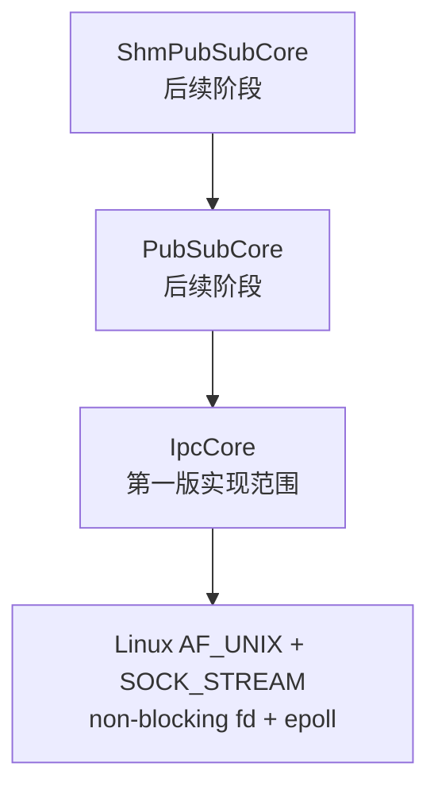

A5. PubSubCore 负责 topic、subscribe、publish、业务恢复和 fan-out 语义。

A6. ShmPubSubCore 负责共享内存句柄、frame metadata、buffer index 和慢订阅者策略。

A7. IpcCore 不向上暴露 socket fd，不直接暴露 errno，不感知 Camera 业务对象。

---

## 3. 核心设计原则

A8. 对外接口返回 `IpcResult` 或 `IpcError`，不用 bool 表达复杂失败原因。

A9. Send 是快速入队接口，不在调用线程执行长时间 socket send。

A10. 每个 Session 拥有独立发送队列和接收缓存，慢客户端只影响自身 Session。

A11. 事件循环线程不得执行长时间阻塞逻辑。

A12. 调用上层回调前必须释放内部锁。

A13. Stop 通过原子状态、eventfd 或 pipe 唤醒 epoll，并按固定顺序释放资源。

A14. IpcCore 内部只使用 `IPC_LOGE`、`IPC_LOGW`、`IPC_LOGI`、`IPC_LOGD`。

---

## 4. 核心对象模型

推荐核心类型命名如下：

```cpp
class IpcServer;
class IpcClient;
class IpcSession;
class IpcEventLoop;
class IpcMessage;
struct IpcServerConfig;
struct IpcClientConfig;
struct IpcStatistics;
enum class IpcError;
enum class IpcConnectionState;
```

推荐命名空间：

```cpp
namespace ipc_core
{
}
```

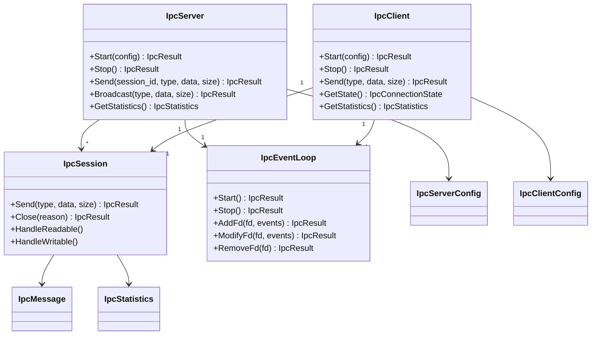

### 4.1 IpcServer

A15. `IpcServer` 负责监听 socket path、创建 listen fd、accept Client、创建和管理 `IpcSession`。

A16. `IpcServer` 对外提供 Start、Stop、Send、Broadcast、CloseSession 和 GetStatistics。

A17. `IpcServer` 不负责 topic、订阅关系、共享内存、Camera frame 和业务恢复。

### 4.2 IpcClient

A18. `IpcClient` 负责主动连接 Server、维护单条 Client 侧 Session、自动重连和上报连接状态变化。

A19. `IpcClient` 默认开启自动重连，连接失败或连接断开后进入重连状态。

A20. `IpcClient` 不恢复订阅关系，不恢复共享内存映射，不恢复 Camera 业务状态。

### 4.3 IpcSession

A21. `IpcSession` 表示一条已建立连接，独占连接 fd 的生命周期。

A22. `IpcSession` 内部维护 session_id、状态、发送队列、接收缓存、partial send 状态、心跳时间和统计信息。

A23. `IpcSession::Send` 只做状态检查、payload 检查、消息封装和入队。

A24. `IpcSession::Close` 负责从 epoll 移除 fd、关闭 fd、清空队列、清空接收缓存并标记最终状态。

### 4.4 IpcEventLoop

A25. `IpcEventLoop` 封装 epoll 创建、fd 注册、事件等待、事件派发和 Stop 唤醒。

A26. Server 第一版使用一个 I/O event loop 线程处理 listen fd 和全部 session fd。

A27. Client 第一版使用一个 I/O event loop 线程处理连接 fd、重连定时和 Stop 唤醒。

A28. 第一版不需要把 EventLoop 扩展成复杂 Reactor 框架。

### 4.5 IpcMessage

A29. `IpcMessage` 包含消息头、message_type、flags、sequence 和 payload。

A30. IpcCore 内部消息类型预留心跳和心跳 ack，内部消息不上抛给上层。

### 4.6 IpcConfig

A31. `IpcServerConfig` 和 `IpcClientConfig` 承载 socket path、队列上限、payload 上限、心跳配置、重连配置和回调配置。

A32. 配置对象在 Start 时校验，非法配置返回 `IpcError::kInvalidArgument`。

### 4.7 IpcStatistics

A33. `IpcStatistics` 提供 Core 级和 Session 级基础统计信息，第一版只做内存内计数，不接入复杂 metrics 系统。

---

## 5. 消息协议设计

A34. 第一版使用固定消息头 + payload 的 stream 协议。

建议消息头字段：

```text
magic
version
header_size
message_type
flags
sequence
payload_size
reserved
```

A35. magic、version 和 header_size 由 IpcCore 填充并校验。

A36. payload_size 必须小于等于配置的 max_payload_size。

A37. 第一版不强制 checksum，后续可以通过 reserved 字段扩展。

A38. 协议解析失败只关闭对应 Session，不影响其他 Session。

---

## 6. epoll 事件循环设计

A39. listen fd、session fd 和 stop wakeup fd 都注册到 epoll。

A40. session fd 默认监听可读事件；当发送队列非空时增加可写事件；队列清空后取消可写事件。

A41. epoll_wait 应设置合理 timeout，用于周期性检查心跳超时、发送阻塞和 Client 重连。

A42. `EAGAIN`、`EWOULDBLOCK`、`EINTR`、对端关闭和 socket error 必须在事件循环内明确处理。

Server 事件循环建议：

```text
RunLoop
  -> epoll_wait
  -> stop fd readable: exit loop
  -> listen fd readable: AcceptLoop
  -> session fd readable: Session.HandleReadable
  -> session fd writable: Session.HandleWritable
  -> periodic check: heartbeat timeout / send stall
```

---

## 7. 发送队列设计

A43. 每个 Session 使用 `std::mutex + std::deque` 保存待发送消息。

A44. 入队前同时检查 max_pending_message_count 和 max_pending_bytes。

A45. 队列满时立即返回 `IpcError::kQueueFull`，不 sleep，不等待，不无限重试。

A46. 队列从空变为非空时，通知 EventLoop 修改 fd 关注 `EPOLLOUT`。

A47. HandleWritable 只发送队首消息，处理 partial send；队首完整发送后再弹出并继续尝试下一条。

A48. 发送有进度时更新 last_send_progress_time，用于慢客户端判断。

普通消息发送流程：

```mermaid
sequenceDiagram
    participant App as 上层调用方
    participant Session as IpcSession
    participant Queue as 发送队列
    participant Loop as IpcEventLoop
    participant Socket as AF_UNIX socket

    App->>Session: Send(type, payload)
    Session->>Session: 检查状态和 payload_size
    Session->>Queue: 封装消息并入队
    alt 队列已满
        Session-->>App: IpcError::kQueueFull
    else 入队成功
        Session->>Loop: 增加 EPOLLOUT / 唤醒
        Session-->>App: IpcError::kOk
        Loop->>Session: fd writable
        Session->>Socket: send header + payload
        Session->>Queue: 发送完成后弹出队首
    end
```

---

## 8. 半包与粘包处理设计

A49. 每个 Session 维护独立接收缓存。

A50. HandleReadable 将 recv 得到的数据追加到接收缓存。

A51. 解析循环先判断 header 是否完整，再校验 header，再判断 payload 是否完整。

A52. payload 完整后组装 `IpcMessage`，内部心跳消息直接消费，普通消息投递给上层回调。

A53. 一个 recv 中包含多条消息时，解析循环需要连续拆包，直到缓存不足以形成下一条完整消息。

普通消息接收流程：

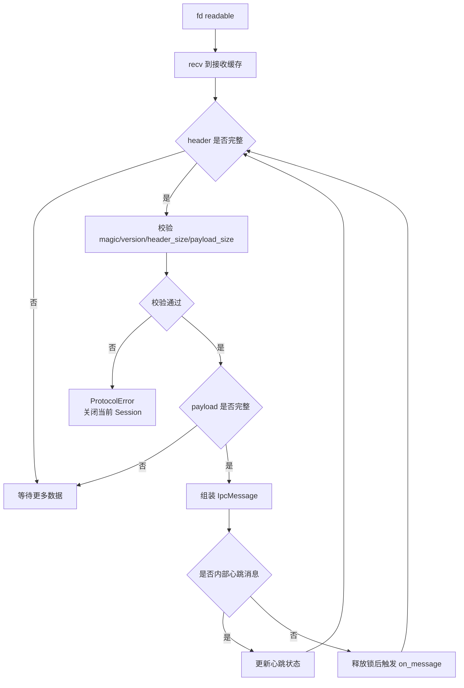

---

## 9. Client 自动重连设计

A54. Client Start 后进入 Connecting 状态并尝试 non-blocking connect。

A55. connect 成功后创建 Client 侧 Session，进入 Connected 状态。

A56. connect 失败或 Session 断开后，如果自动重连开启，则进入 Reconnecting 状态。

A57. 重连定时在 Client EventLoop 内处理，第一版使用简单间隔或轻量退避，不做复杂指数退避和熔断。

A58. 重连成功后只触发 OnConnected，业务恢复由后续 PubSubCore 处理。

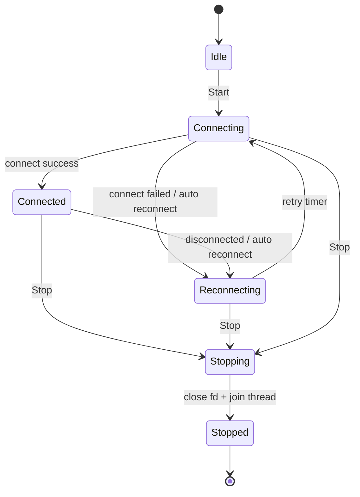

---

## 10. 心跳与超时设计

A59. 心跳消息由 IpcCore 内部生成，使用内部 message_type。

A60. EventLoop 周期性检查是否到达 heartbeat_interval_ms，到期则发送心跳。

A61. 收到任意有效消息都更新 last_recv_time。

A62. 超过 heartbeat_timeout_ms 未收到对端有效消息，则关闭对应 Session 并上报 disconnected。

A63. Client 侧 Session 超时后按自动重连策略处理。

---

## 11. 慢客户端处理设计

A64. 队列满和发送阻塞是两个不同场景。

A65. 队列满表示上层生产速度超过队列容量，Send 直接返回 QueueFull。

A66. 发送阻塞表示队列长期非空且 socket 没有发送进度，超过 send_stall_timeout_ms 后关闭该 Session。

A67. Server 关闭慢客户端 Session 前应从 epoll 移除 fd，关闭 fd，清空发送队列和接收缓存，然后上报 disconnected。

A68. 慢客户端处理不得影响其他 Session 的发送。

---

## 12. 生命周期与资源释放设计

A69. fd 所有权必须明确：listen fd 属于 IpcServer，连接 fd 属于对应 IpcSession，epoll fd 和 stop wakeup fd 属于 IpcEventLoop。

A70. Start 失败时必须释放已创建资源，避免半初始化对象泄露 fd 或线程。

A71. Stop 可重复调用，第一次执行真实停止流程，后续直接返回已停止结果。

A72. Stop 顺序建议为：设置 stopping 状态、唤醒 event loop、阻止新 Send 入队、关闭 listen fd、关闭所有 Session、等待线程退出、清理容器、进入 stopped 状态。

A73. Stop 后不得触发新的消息回调；已经进入执行中的回调不强制中断，但 Stop 不应永久等待上层长时间阻塞回调。

A74. 析构函数不抛异常，如果对象尚未 Stop，应尽最大努力调用 Stop。

Stop 退出流程：

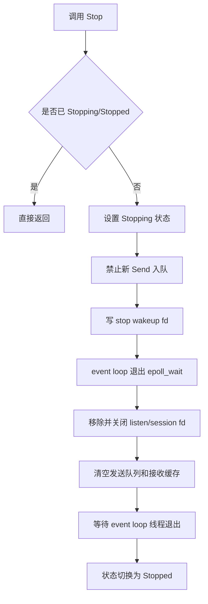

---

## 13. 日志模块设计

A75. 建议提供 `ipc_logger.h`，只定义薄日志宏，不引入复杂日志类。

A76. Linux 调试版默认通过 `std::fprintf` 打印到 stdout / stderr。

A77. Android 后续版本可将宏替换为 `__android_log_print`。

A78. 真实车机项目可将宏替换为项目已有日志接口。

A79. IpcCore 业务代码只允许调用以下宏：

```text
IPC_LOGE
IPC_LOGW
IPC_LOGI
IPC_LOGD
```

`ipc_logger.h` 建议设计：

```text
1. 定义默认 IPC_LOG_TAG，建议默认值为 "IpcCore"。
2. 如果外部未定义 IPC_LOGE / IPC_LOGW / IPC_LOGI / IPC_LOGD，则提供 Linux 控制台默认实现。
3. 通过 IPC_ENABLE_DEBUG_LOG 控制 debug 日志是否编译启用。
4. 高频日志需要限频辅助宏或调用点限频策略。
```

默认 tag 建议：

```cpp
#define IPC_LOG_TAG "IpcCore"
```

A80. 正常每条消息收发不打印 info 日志，只在 debug 模式或限频条件下输出。

---

## 14. 与 PubSubCore 的边界

A81. IpcCore 不包含 topic、subscribe、unsubscribe、publisher register、subscriber fan-out 和订阅恢复。

A82. IpcCore 只提供普通 message_type + payload 通道。

A83. PubSubCore 后续可以把订阅控制消息和业务 metadata 编码为 IpcCore payload。

A84. Client 重连成功后的订阅恢复由 PubSubCore 根据 OnConnected 完成。

---

## 15. 与 ShmPubSubCore 的边界

A85. IpcCore 不管理共享内存区域、buffer index、frame ready 状态和共享内存版本。

A86. ShmPubSubCore 后续可以通过 IpcCore 发送 frame metadata 或共享内存控制消息。

A87. AHardwareBuffer、GraphicBuffer 和 fd passing 不属于第一版 IpcCore。

---

## 16. 后续 Android 扩展预留

A88. Android 扩展只作为后续规划，不进入第一版 Linux 调试需求。

A89. 预留方向包括 Android native log、Android socket 权限、SELinux 策略、fd passing、AHardwareBuffer handle 传递和 GraphicBuffer 接入。

A90. 如后续支持 fd passing，应新增独立传输扩展层，不污染第一版普通 stream 消息路径。

---

## 17. 推荐文件结构

第一版推荐文件结构：

```text
ipc_core/
  ipc_common.h
  ipc_error.h
  ipc_logger.h
  ipc_message.h
  ipc_config.h
  ipc_statistics.h
  ipc_session.h
  ipc_session.cpp
  ipc_server.h
  ipc_server.cpp
  ipc_client.h
  ipc_client.cpp
  ipc_event_loop.h
  ipc_event_loop.cpp
```

可选 demo 和测试：

```text
demo_echo_server.cpp
demo_echo_client.cpp
test_ipc_server.cpp
test_ipc_client.cpp
```

A91. 第一版不建议拆出复杂 reactor、connector、acceptor、pipeline、codec 层或 thread pool。

---

## 18. 风险点与规避建议

A92. 风险：Send 在调用线程阻塞导致上层卡死。规避：Send 只入队，队列满立即返回错误。

A93. 风险：慢客户端拖垮 Server。规避：每个 Session 独立队列，发送阻塞超时后关闭该 Session。

A94. 风险：Stop 死锁。规避：Stop 唤醒 event loop，不在持锁状态等待线程退出，不在持锁状态调用上层回调。

A95. 风险：半包粘包处理遗漏。规避：接收缓存按 header + payload_size 循环解析，并为半包、粘包、非法协议写测试。

A96. 风险：日志过多影响压力测试。规避：高频日志限频，正常消息收发默认不打印 info 日志。

A97. 风险：第一版范围膨胀。规避：Android、PubSubCore、ShmPubSubCore、Camera 业务全部留到后续阶段。

---

## 19. Mermaid 架构图

### 19.1 总体分层图

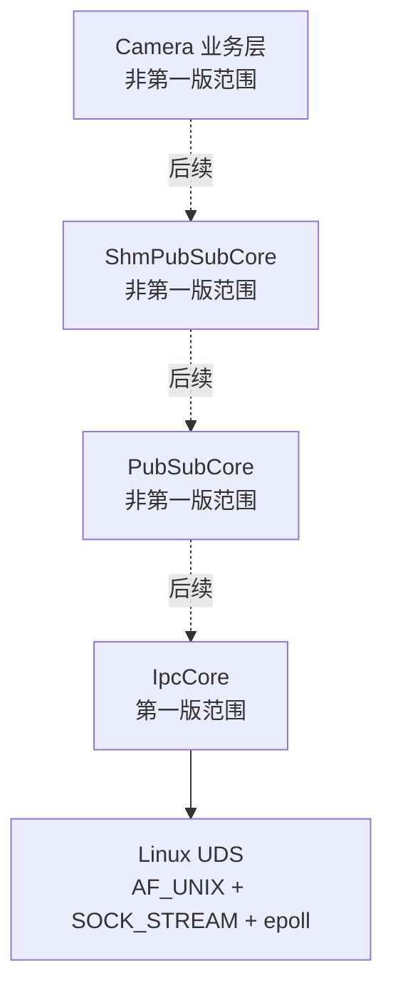

### 19.2 Server / Client / Session 关系图

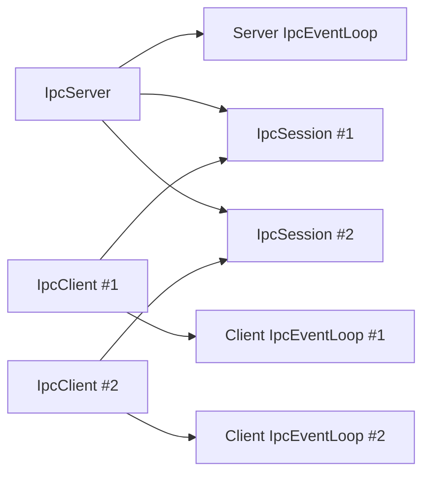

### 19.3 普通消息发送流程图

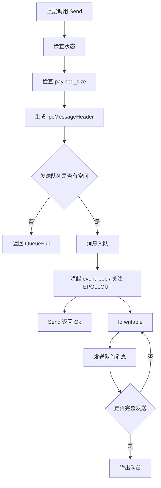

### 19.4 普通消息接收流程图

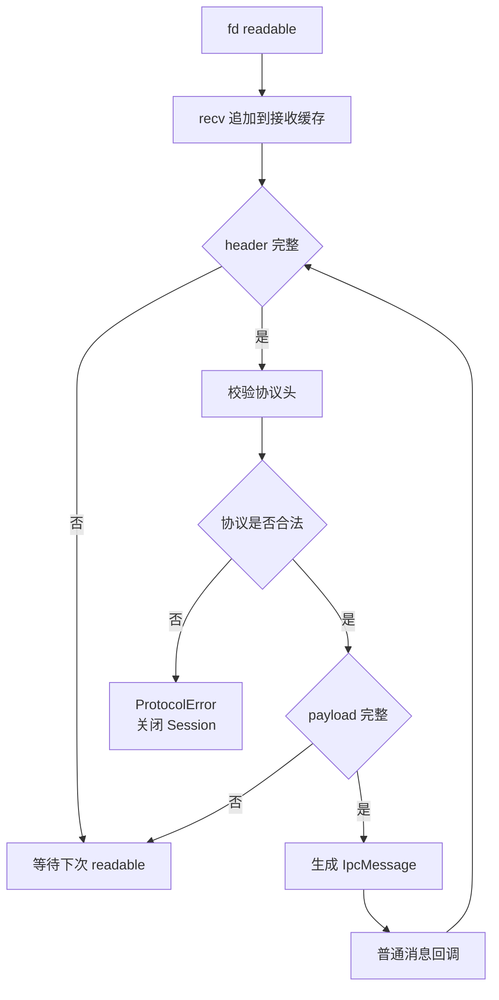

### 19.5 Client 自动重连流程图

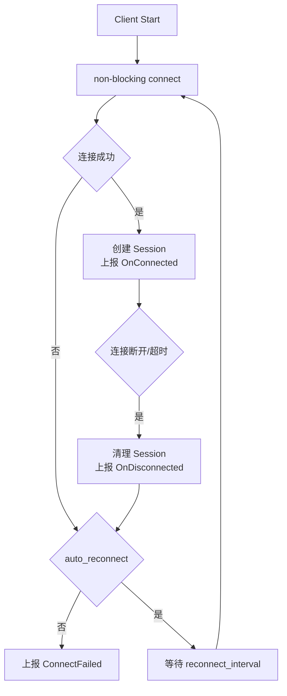

### 19.6 Stop 退出流程图

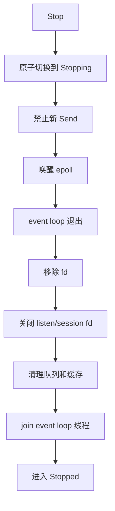
